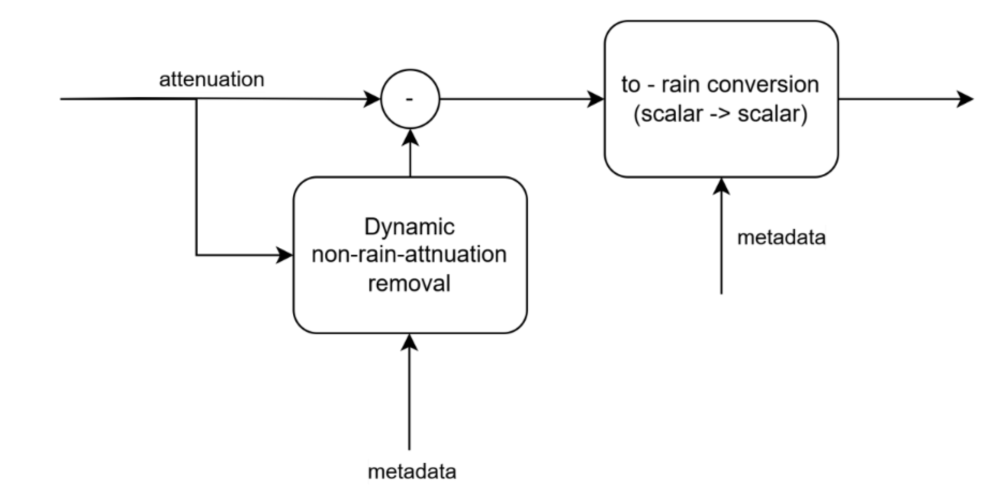
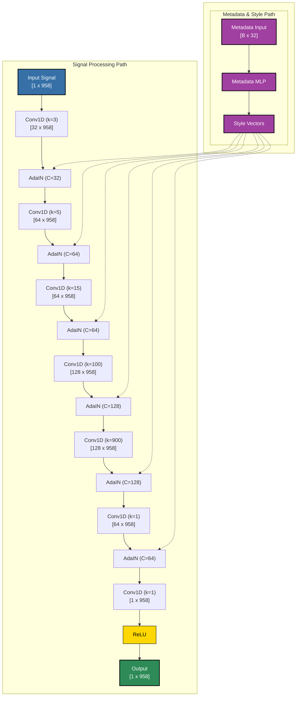
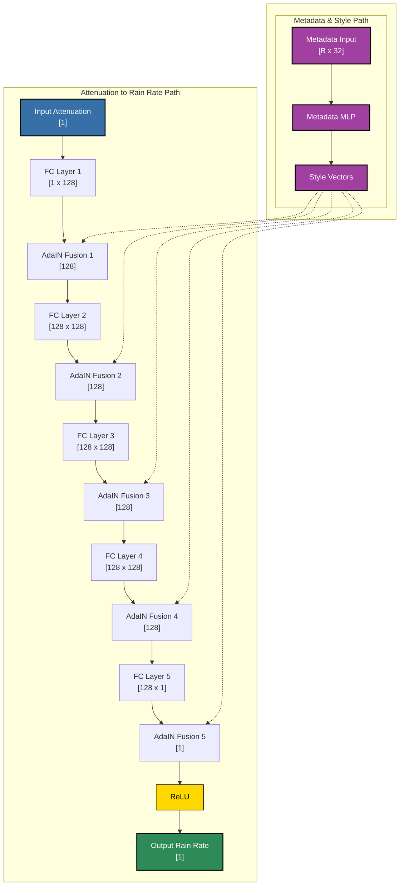

# Rain Estimation from CML Data

We want to estimate rain rate from Commercial Microwave Links (CML) using their Transmitted Signal Level (TSL) and Received Signal Level (RSL) signals. We will take a data-driven approach and train a neural network to perform this translation.

## Data

We are working with OpenMRG, a dataset collected in Sweden.

**OpenMRG Quick Facts:**
- **Observation Period:** June–August 2015 (summer season, including heavy convective events).
- **Region:** Greater Gothenburg, south-west Sweden (≈ 57.6°N, 11.9°E).
- **Sensors Provided:**
    - 271 commercial microwave sub-links (RSL & TSL every 10s, 6–38 GHz, 0.1–7 km path lengths).
    - 46 tipping-bucket rain gauges (0.1 mm tips, 1 min logging).
    - 1 SMHI reference gauge (1 min).
    - C-band weather radar composite (240×240 pixels, 1 km resolution, 5 min scans).
- **Public Release:** Zenodo (DOI: 10.5281/zenodo.7107689), CC-BY-4.0 license.
- **Pre-processing in PyNNcml:**
    - Radar reflectivity is converted to rain rate (Z = 200R¹·⁵) and averaged to 15 min.
    - Gauges are converted to a 15 min rain-rate using a 15-minute moving window.
    - RSL/TSL data remains at its native 10s resolution but is folded into 15-minute blocks (90 samples) to align with the targets.

These harmonised series (rain gauge, radar, and CML attenuation) are what the neural network pipeline in this project will ingest for training and validation.

## Model Architecture

The idea is to separate the task into two relatively simple models. The first model will evaluate the baseline attenuation signal (which includes both the constant free-space attenuation and any non-rain related attenuation). The output of this model will then be subtracted from the original attenuation signal.

The next step is to convert the compensated attenuation signal to a rain rate. Given the metadata (link frequency, length, etc.), this is a scalar conversion where each time sample is processed individually. This approach will hopefully yield easily interpretable models.

### Attenuation Baseline Removal Architecture

**Inputs:**
- Attenuation signal (1D array)
- Link metadata (frequency, polarization, etc.)

**Outputs:**
- Attenuation signal (1D array)

We will use a simple CNN-based architecture with a StyleGAN-like approach for metadata fusion.

### Attenuation to Rain Rate Architecture

Here we use a Fully Connected (FC) network with StyleGAN-like metadata fusion.

**Inputs:**
- Attenuation signal (single value)
- Link metadata (frequency, polarization, etc.)

**Outputs:**
- Rain rate (single value)

## Development Methodology
### Step 1 - data inspection
using the pyncnn dataloader, explore the given data.
take a single example:
plot rsl and tsl signal data with the corresponding datetimes. 
plot rain rate data with the corresponding datetimes.
script is implemented in ./data_inspection/data_inspection.py.
### Step 2 - implement the models
as described in the above section implement the two models
1. ./models/attanuation_baseline_removal.py
2. ./models/attanuation_to_rainrate.py
3. ./models/physics_informed_rain_estimation.py (this is a wrapper which include the two models with appropriate connections).
### Step 3 - implement a trainer
create a trainer to train the physics_informed_rain_estimation model. 
the loss function is l2 on rain rate, with proper weightening to account for the imbalance in the dry / wet (there is 10x more dry then wet periods). another regulizer will be added after the attnuation substruction. so that we expect '0' attanuation before the convertion if there is a dry period. 
crucial features for the trainers are:
1. save checkpoints into ./results/checkpoints.
2. print loss function and the two components (before and after scaling). both for test set and train in every epoch
3. generate tensorflow training graphs.
4. keep active window which shows single training example (for example the first one in the first batch). for this sample we want to see a graph of the real rain vs predicted rain. another graph for the original attanuation with the subtracted version.

### step 4 - train
train the model, we will need to stop here and iterate if we don't get a proper result.
we have the loss function and the graph vizualization to get an insight of whats going right or wrong.

### step 5 - analyze results
we want to see the following:
1. graph of 1 random example from the training set with real rain and predicted rain. as well the original and compensated attanuation signal.
2. another graph with 1 random sample from test set.
3. graph for our worst performing training sample
4. graph for our worst performaing test sample

 

